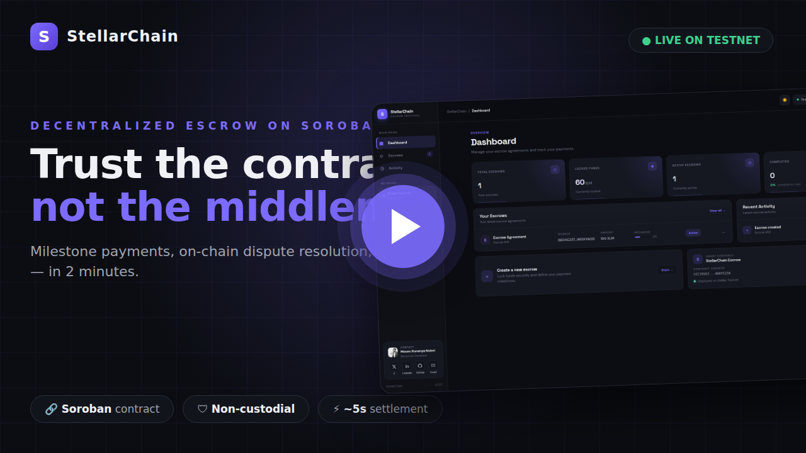

# StellarChain

### Decentralized Escrow Infrastructure Built on Stellar Soroban

StellarChain is a decentralized escrow payment platform built on the Stellar Network using Soroban smart contracts.

The platform enables participants to create programmable escrow agreements where funds are locked by a smart contract and released according to predefined conditions. It supports milestone-based payments, dispute resolution, deadline-based refunds, cancellation, and Stellar wallet integration.

The project is designed to demonstrate how traditional escrow workflows can be implemented as transparent, programmable, and verifiable blockchain infrastructure without requiring a centralized intermediary to custody funds.

<div align="center">

<a href="docs/video/stellarchain_pitch.mp4">
  
</a>

**▶ Watch the 2-minute product pitch — [click the thumbnail](docs/video/stellarchain_pitch.mp4) or [open the video here](docs/video/stellarchain_pitch.mp4)**

  

[Live Application](https://stellar-escrow-platform.vercel.app/) · [Pitch Video](docs/video/stellarchain_pitch.mp4) · [GitHub Repository](https://github.com/mosesifunanya/Stellar-Escrow-Platform)

</div>

---

## Product Pitch Video

Watch the full pitch (2 min 24 s): **[▶ docs/video/stellarchain_pitch.mp4](docs/video/stellarchain_pitch.mp4)**

| Chapter | What you'll see |
| --- | --- |
| 0:00 | The problem: someone has to go first |
| 0:22 | StellarChain: the contract is the escrow agent |
| 0:45 | Architecture: React → Express → Soroban |
| 1:00 | Live product tour on the Stellar testnet |
| 1:12 | Creating an escrow, signed and settled on-chain in ~20 s |
| 1:29 | The Rust contract engine: authorization enforced on-chain |
| 1:40 | Milestones complete themselves · deadline refunds · disputes resolved by the arbiter |
| 2:04 | Why Stellar · 15 passing contract tests · try it live |

*Every transaction shown in the video is a real, wallet-signed transaction settled on the Stellar testnet — no mocks, no simulations.*

---

## Overview

StellarChain provides an on-chain escrow mechanism for transactions between a payer and a worker.

Instead of sending payment directly to a worker and relying entirely on trust, the payer deposits funds into a Soroban smart contract. The contract maintains the escrow state and controls how and when those funds can be released.

An escrow agreement contains:

- Payer
- Worker
- Arbiter
- Token
- Total escrow amount
- Deadline
- Milestones
- Remaining escrow balance
- Current escrow status

The smart contract becomes the source of truth for the financial state of the agreement.

---

## Problem

Traditional escrow systems often depend on centralized intermediaries.

This creates several challenges:

- Users must trust a third party to hold their funds.
- Payment release may depend on manual intervention.
- Disputes require centralized arbitration.
- Transaction history may not be independently verifiable.
- Cross-border payments can introduce additional friction.
- Users have limited visibility into the actual custody and movement of funds.

For blockchain-native transactions, escrow logic can instead be represented directly by programmable smart contracts.

---

## Solution

StellarChain moves the core escrow logic onto Stellar Soroban.

The platform allows a payer to:

1. Connect a Stellar wallet.
2. Define a worker and arbiter.
3. Specify an escrow amount.
4. Define one or more milestones.
5. Set a deadline.
6. Review the agreement.
7. Sign the transaction through the connected wallet.
8. Deposit funds into the escrow contract.

After the escrow is created, the smart contract controls the remaining funds.

The payer can release milestones, open a dispute, cancel an active escrow, or request a deadline-based refund.

If a dispute occurs, the designated arbiter can resolve the dispute in favor of either the worker or payer.

---

# Core Features

## Escrow Creation

Users can create an escrow agreement containing:

- Payer address
- Worker address
- Arbiter address
- Token address
- Total amount
- Deadline
- Milestone configuration

The contract validates the escrow parameters before accepting the agreement.

---

## Milestone-Based Payments

An escrow can contain multiple milestones.

Each milestone contains:

- Milestone ID
- Amount
- Status

A milestone starts as:

`Pending`

After an authorized release:

`Released`

When every milestone has been released, the escrow transitions to:

`Released`

The contract also tracks the remaining escrow balance.

---

## Dispute Management

An active escrow can be placed into a dispute state.

The escrow status becomes:

`Disputed`

The designated arbiter can then resolve the dispute by selecting:

- Worker
- Payer

If the worker wins, the remaining balance is transferred to the worker.

If the payer wins, the remaining balance is returned to the payer.

---

## Deadline-Based Refunds

Escrows have a predefined deadline.

Once the deadline has passed, the payer can request a refund of the remaining escrow balance.

The contract verifies the ledger timestamp before allowing the refund.

This prevents refunds from being executed before the configured deadline.

---

## Escrow Cancellation

An active escrow can be cancelled by the payer.

When cancellation succeeds, the remaining escrow balance is returned to the payer and the escrow is transitioned to a refunded state.

---

## Wallet Integration

The frontend integrates with Stellar Wallets Kit.

Users can:

- Connect a Stellar wallet
- Retrieve their public address
- Sign transactions
- Disconnect their wallet
- Restore the wallet address after refreshing the application

Private keys are not stored by the application.

---

## Stellar Testnet

The current deployment runs on Stellar Testnet.

### Contract

```text
CCC7XVVJTLC7FIEYYDGVDNRR7SLACNJCSBV3EQRGOFPP6Y5L4DAYS22A
```

### Network

```text
Stellar Testnet
```

### Soroban RPC

```text
https://soroban-testnet.stellar.org
```

---

# Architecture

StellarChain follows a layered architecture consisting of three primary application layers:

```text
┌─────────────────────────────────────────────────────────────┐
│                       USER / WALLET                         │
│                                                             │
│              Stellar Wallets Kit / Wallet                   │
└──────────────────────────────┬──────────────────────────────┘
                               │
                               │ Sign Transaction
                               ▼
┌─────────────────────────────────────────────────────────────┐
│                     REACT FRONTEND                           │
│                                                             │
│  React + Vite                                               │
│                                                             │
│  • Dashboard                                                │
│  • Escrow Management                                        │
│  • Milestone Management                                     │
│  • Dispute Management                                       │
│  • Refund / Cancellation                                    │
│  • Wallet Connection                                        │
│                                                             │
└───────────────┬───────────────────────────────┬─────────────┘
                │                               │
                │ REST API                      │ Stellar RPC
                ▼                               ▼
┌──────────────────────────────┐     ┌─────────────────────────┐
│       EXPRESS BACKEND        │     │     STELLAR TESTNET     │
│                              │     │                         │
│ TypeScript + Express        │     │      Soroban RPC        │
│                              │     │                         │
│ • Request validation         │     └────────────┬────────────┘
│ • Escrow controllers         │                  │
│ • Contract service           │                  │
│ • Contract client            │                  ▼
│ • Transaction preparation    │     ┌─────────────────────────┐
│                              │     │   SOROBAN CONTRACT       │
└──────────────┬───────────────┘     │                         │
               │                     │ escrow_core             │
               │                     │                         │
               └────────────────────► • Create escrow          │
                                     │ • Store state            │
                                     │ • Transfer funds         │
                                     │ • Release milestones     │
                                     │ • Open disputes          │
                                     │ • Resolve disputes       │
                                     │ • Refund                 │
                                     │ • Cancel                 │
                                     │ • Emit events            │
                                     └─────────────────────────┘
```

The architecture intentionally separates presentation, API orchestration, and financial state.

The frontend provides the user experience.

The backend prepares and interacts with contract transactions.

The Soroban contract maintains the authoritative escrow state and executes the actual token transfers.

---

# System Flow

## Creating an Escrow

```text
User
 │
 │ Connect Wallet
 ▼
React Frontend
 │
 │ Escrow details
 ▼
Express Backend
 │
 │ Prepare contract transaction
 ▼
Soroban Contract Client
 │
 │ Transaction XDR
 ▼
Frontend
 │
 │ Wallet signs transaction
 ▼
Stellar Testnet RPC
 │
 │ Submit signed transaction
 ▼
Soroban Escrow Contract
 │
 ├── Validate payer authorization
 ├── Validate amount
 ├── Validate deadline
 ├── Validate milestones
 ├── Transfer tokens to contract
 ├── Store escrow
 └── Emit EscrowCreated
 │
 ▼
Transaction Confirmation
 │
 ▼
Frontend refreshes escrow data
```

The frontend implementation follows this transaction flow by sending escrow information to the backend, receiving a prepared transaction XDR, requesting wallet signing, submitting the signed transaction to Stellar RPC, and polling for confirmation.

---

# Smart Contract

The core financial logic is implemented in:

```text
contracts/escrow_core/src/lib.rs
```

The contract is written in Rust using the Soroban SDK.

The contract is compiled as a `no_std` Soroban contract and uses persistent and instance storage to maintain escrow state.

## Contract Data Model

### Escrow

```rust
pub struct Escrow {
    pub payer: Address,
    pub worker: Address,
    pub arbiter: Address,
    pub token: Address,
    pub amount: i128,
    pub remaining_amount: i128,
    pub deadline: u64,
    pub status: EscrowStatus,
    pub milestones: Vec<Milestone>,
}
```

### Milestone

```rust
pub struct Milestone {
    pub id: u32,
    pub amount: i128,
    pub status: MilestoneStatus,
}
```

---

# Contract Entry Points

| Function            | Purpose                                              |
| ------------------- | ---------------------------------------------------- |
| `create_escrow`     | Creates and funds a new escrow                       |
| `get_escrow`        | Retrieves escrow information                         |
| `get_escrow_count`  | Returns the latest escrow ID                         |
| `release_milestone` | Releases a milestone payment                         |
| `open_dispute`      | Places an active escrow into dispute                 |
| `resolve_dispute`   | Resolves a dispute in favor of the worker or payer   |
| `refund_escrow`     | Refunds remaining funds after the deadline           |
| `cancel_escrow`     | Cancels an active escrow and refunds remaining funds |

The generated TypeScript contract client exposes the same contract interface to the backend application.

---

# Escrow Lifecycle

```text
                     ┌──────────────┐
                     │    Create    │
                     └──────┬───────┘
                            │
                            ▼
                     ┌──────────────┐
                     │    Active    │
                     └──────┬───────┘
                            │
             ┌──────────────┼───────────────┐
             │              │               │
             ▼              ▼               ▼
      Release Milestone   Dispute        Cancel
             │              │               │
             │              ▼               ▼
             │        ┌─────────────┐   Refunded
             │        │  Disputed   │
             │        └──────┬──────┘
             │               │
             │          Arbiter resolves
             │               │
             │        ┌──────┴───────┐
             │        ▼              ▼
             │     Worker          Payer
             │       │               │
             │       ▼               ▼
             │    Released        Refunded
             │
             ▼
       All milestones
          released
             │
             ▼
         Released

Active + deadline reached
             │
             ▼
          Refunded
```

---

# Contract State Model

The escrow contract defines four primary escrow states:

```text
Active
Released
Refunded
Disputed
```

### Active

The escrow is currently operational.

Milestones can be released and the escrow can enter a dispute, be cancelled, or become eligible for refund after its deadline.

### Released

All escrow funds have been distributed to the worker.

### Refunded

The remaining escrow funds have been returned to the payer.

### Disputed

The escrow has entered a dispute and the arbiter can determine the recipient of the remaining balance.

---

# Authorization Model

Authorization is enforced at the smart contract layer.

The contract uses Soroban's authorization mechanism:

```rust
payer.require_auth();
```

The relevant roles are:

### Payer

Responsible for:

- Creating the escrow
- Releasing milestones
- Opening disputes
- Cancelling active escrows
- Claiming deadline-based refunds

### Worker

Receives milestone payments and dispute awards.

### Arbiter

Responsible for resolving disputed escrows.

This separation ensures that sensitive operations require authorization from the appropriate blockchain address.

---

# Token Flow

When an escrow is created:

```text
Payer
  │
  │ Token transfer
  ▼
Escrow Contract
```

When a milestone is released:

```text
Escrow Contract
  │
  │ Milestone amount
  ▼
Worker
```

When the payer wins a dispute:

```text
Escrow Contract
  │
  │ Remaining balance
  ▼
Payer
```

When a deadline refund succeeds:

```text
Escrow Contract
  │
  │ Remaining balance
  ▼
Payer
```

The contract uses Stellar's token client to execute these transfers.

---

# Contract Events

The contract emits events for important state transitions.

Available events include:

```text
EscrowCreated
MilestoneReleased
DisputeOpened
DisputeResolved
EscrowRefunded
EscrowCancelled
```

These events provide an auditable representation of important escrow actions on the Stellar network.

---

# Frontend

The frontend is a React application powered by Vite.

Current frontend dependencies include:

- React
- React DOM
- Vite
- Stellar SDK
- Stellar Wallets Kit
- ESLint

The frontend package configuration confirms the React/Vite architecture and Stellar wallet integration.

## Dashboard

The application provides a dashboard for interacting with escrow agreements.

Users can:

- View escrow activity
- View escrow details
- Create new escrows
- View milestones
- Release milestones
- Open disputes
- Resolve disputes
- Request refunds
- Cancel escrows
- Connect and disconnect wallets

---

# Backend

The backend is a TypeScript Express application.

Its responsibilities include:

- Receiving escrow requests
- Validating request parameters
- Preparing contract transactions
- Calling the generated Soroban contract client
- Reading escrow state
- Returning blockchain data to the frontend
- Converting BigInt values into JSON-compatible strings

The backend exposes its escrow routes through:

```text
/api/escrows
```

The application uses Express, CORS, dotenv, TypeScript, and the Stellar SDK.

---

# API Reference

## Get All Escrows

```http
GET /api/escrows?publicKey={PUBLIC_KEY}
```

Returns escrow records associated with the supplied public key.

---

## Get Escrow

```http
GET /api/escrows/{id}?publicKey={PUBLIC_KEY}
```

Returns a specific escrow.

---

## Create Escrow

```http
POST /api/escrows
```

Example request:

```json
{
  "payer": "G...",
  "worker": "G...",
  "arbiter": "G...",
  "token": "C...",
  "amount": "100000000",
  "deadline": "1760000000",
  "milestones": [
    {
      "id": 1,
      "amount": "50000000",
      "status": "Pending"
    },
    {
      "id": 2,
      "amount": "50000000",
      "status": "Pending"
    }
  ]
}
```

---

## Release Milestone

```http
POST /api/escrows/{id}/release-milestone
```

Request:

```json
{
  "publicKey": "G...",
  "milestoneId": 1
}
```

---

## Open Dispute

```http
POST /api/escrows/{id}/open-dispute
```

Request:

```json
{
  "publicKey": "G..."
}
```

---

## Resolve Dispute

```http
POST /api/escrows/{id}/resolve-dispute
```

Request:

```json
{
  "publicKey": "G...",
  "winner": "Worker"
}
```

Supported winners:

```text
Worker
Payer
```

---

## Refund Escrow

```http
POST /api/escrows/{id}/refund
```

Request:

```json
{
  "publicKey": "G..."
}
```

---

## Cancel Escrow

```http
POST /api/escrows/{id}/cancel
```

Request:

```json
{
  "publicKey": "G..."
}
```

The current backend route layer exposes these escrow operations directly through Express controllers.

---

# Technology Stack

## Blockchain

- Stellar Network
- Soroban
- Stellar Testnet
- Soroban SDK
- Stellar RPC

## Smart Contracts

- Rust
- Soroban SDK

## Frontend

- React
- Vite
- JavaScript
- Stellar SDK
- Stellar Wallets Kit
- CSS

## Backend

- Node.js
- Express
- TypeScript
- Stellar SDK
- dotenv
- CORS

## Development

- Cargo
- Stellar CLI
- npm
- Git
- GitHub

The repository is organized as a Cargo workspace for the Soroban contracts and separate frontend/backend applications.

---

# Project Structure

```text
Stellar-Escrow-Platform/
│
├── backend/
│   ├── src/
│   │   ├── contract-client/
│   │   │   └── src/
│   │   │       └── index.ts
│   │   │
│   │   ├── controllers/
│   │   │   └── escrowController.ts
│   │   │
│   │   ├── routes/
│   │   │   └── escrowRoutes.ts
│   │   │
│   │   ├── services/
│   │   │   └── escrowService.ts
│   │   │
│   │   ├── app.ts
│   │   └── server.ts
│   │
│   ├── package.json
│   └── tsconfig.json
│
├── contracts/
│   └── escrow_core/
│       ├── src/
│       │   ├── lib.rs
│       │   └── test.rs
│       └── Cargo.toml
│
├── frontend/
│   ├── src/
│   │   ├── assets/
│   │   ├── App.jsx
│   │   ├── App.css
│   │   └── wallet.js
│   │
│   ├── package.json
│   └── vite.config.js
│
├── Cargo.toml
├── Cargo.lock
├── README.md
└── .gitignore
```

---

# Getting Started

## Prerequisites

Before running StellarChain locally, install:

- Node.js
- npm
- Rust
- Cargo
- Stellar CLI
- Git

Verify the installations:

```bash
node --version
npm --version
rustc --version
cargo --version
stellar --version
```

---

# Clone the Repository

```bash
git clone https://github.com/mosesifunanya/Stellar-Escrow-Platform.git

cd Stellar-Escrow-Platform
```

---

# Run the Smart Contract

Build the Soroban contract:

```bash
stellar contract build
```

Run the Rust tests:

```bash
cargo test
```

The repository contains contract-level tests covering escrow creation, milestone release, disputes, refunds, cancellation, validation, authorization, and related state transitions.

---

# Run the Backend

Navigate into the backend:

```bash
cd backend
```

Install dependencies:

```bash
npm install
```

Start the development server:

```bash
npm run dev
```

The backend defaults to:

```text
http://localhost:5000
```

---

# Run the Frontend

Open another terminal:

```bash
cd frontend
```

Install dependencies:

```bash
npm install
```

Start Vite:

```bash
npm run dev
```

The frontend will normally be available at:

```text
http://localhost:5173
```

---

# Environment Variables

The frontend can optionally use:

```env
VITE_API_URL=http://localhost:5000
```

The application falls back to the local backend during development when `VITE_API_URL` is not provided.

For production deployments, configure the appropriate backend URL through the hosting provider's environment settings.

---

# Smart Contract Development

The repository uses a Cargo workspace:

```toml
[workspace]
resolver = "2"

members = [
  "contracts/*",
]
```

The workspace uses:

```text
soroban-sdk = 27
```

The release profile is optimized for WebAssembly deployment.

Build the contract:

```bash
stellar contract build
```

Run tests:

```bash
cargo test
```

Format Rust code:

```bash
cargo fmt
```

---

# Testing

Smart contract testing is an important part of the project because escrow operations directly control funds.

The contract test suite is located at:

```text
contracts/escrow_core/src/test.rs
```

Tests cover important contract behavior including:

- Escrow creation
- Multiple escrows
- Escrow retrieval
- Milestone release
- Complete milestone release
- Dispute creation
- Dispute resolution
- Worker dispute outcomes
- Payer dispute outcomes
- Deadline refunds
- Cancellation
- Authorization
- Invalid amounts
- Invalid deadlines
- Invalid milestone configurations

Run:

```bash
cargo test
```

---

# Security Considerations

StellarChain is designed around smart-contract-enforced authorization and state transitions.

## Authorization

Sensitive contract functions use Soroban authorization checks.

For example:

```rust
payer.require_auth();
```

The arbiter is also required to authorize dispute resolution.

---

## Validation

The contract validates:

- Escrow amount
- Milestone count
- Milestone amounts
- Total milestone value
- Deadline
- Escrow state
- Milestone state
- Remaining escrow balance

For example, the total milestone amounts must equal the escrow amount before the contract accepts the escrow.

---

## No Private-Key Custody

The application does not require users to submit private keys.

Transactions are signed through the connected Stellar wallet.

The frontend stores only the public wallet address locally for session restoration.

---

## On-Chain Source of Truth

Financial state is maintained by the Soroban contract rather than by a centralized application database.

This means the important escrow state can be independently verified on the Stellar network.

---

# Known Limitations

This project is currently deployed on Stellar Testnet and should be treated as a development and demonstration platform rather than production financial infrastructure.

Current limitations include:

- Testnet deployment only
- No production audit
- No mainnet deployment
- Limited dispute mechanisms
- Single arbiter model
- No multi-arbiter voting
- No protocol fee mechanism
- No advanced reputation system
- No persistent off-chain database
- No production-grade indexing infrastructure

These limitations provide opportunities for future development.

---

# Future Improvements

Potential improvements include:

### Multi-Arbiter Dispute Resolution

Introduce multiple arbiters and quorum-based dispute resolution.

```text
Arbiter 1 ─┐
Arbiter 2 ─┼──► Majority Decision
Arbiter 3 ─┘
```

### Stablecoin Support

Expand beyond the current token configuration to support assets such as Stellar ecosystem stablecoins.

### Escrow Templates

Allow users to create reusable escrow templates for:

- Freelancing
- Digital services
- Procurement
- P2P transactions
- Cross-border payments

### Reputation

Introduce an on-chain reputation layer based on completed escrow agreements.

### Notifications

Add transaction and milestone notifications.

### Indexing

Introduce a dedicated blockchain indexer for faster escrow discovery and historical activity.

### Mainnet Deployment

After security review, extensive testing, and audit:

```text
Testnet
   │
   ▼
Security Review
   │
   ▼
Audit
   │
   ▼
Mainnet
```

### Enhanced Security

Future versions should consider:

- Formal state-machine verification
- More extensive negative-path testing
- Contract upgrade strategy
- Storage lifecycle management
- Rate limiting
- Transaction replay protection at application boundaries
- Production monitoring
- External smart contract audit

---

# Why Stellar?

Stellar is particularly well suited to payment-oriented applications because its ecosystem provides infrastructure for fast settlement and asset transfers.

StellarChain uses Soroban to extend that payment infrastructure with programmable escrow logic.

The result combines:

```text
Stellar Payments
        +
Soroban Smart Contracts
        +
Wallet-Based Authorization
        +
Programmable Escrow
        =
Decentralized Payment Infrastructure
```

---

# Project Status

```text
Frontend                 ✓
Backend                  ✓
Soroban Contract         ✓
Wallet Integration       ✓
Milestone Payments       ✓
Dispute Resolution       ✓
Deadline Refunds         ✓
Cancellation             ✓
Testnet Deployment       ✓
Production Audit         ✗
Mainnet Deployment       ✗
```

---

# Deployment

### Live Application

https://stellar-escrow-platform.vercel.app/

### GitHub

https://github.com/mosesifunanya/Stellar-Escrow-Platform

### Stellar Testnet Contract

```text
CCC7XVVJTLC7FIEYYDGVDNRR7SLACNJCSBV3EQRGOFPP6Y5L4DAYS22A
```

---

# Contributing

Contributions, ideas, and improvements are welcome.

### 1. Fork the repository

```bash
git fork
```

### 2. Clone your fork

```bash
git clone <your-repository-url>
```

### 3. Create a feature branch

```bash
git checkout -b feature/your-feature
```

### 4. Make your changes

Ensure the frontend, backend, and contract continue to build successfully.

### 5. Run tests

```bash
cargo test
```

### 6. Commit your changes

```bash
git add .

git commit -m "Add your feature"
```

### 7. Push your branch

```bash
git push origin feature/your-feature
```

### 8. Open a Pull Request

Explain the problem, implementation, testing performed, and any relevant architectural considerations.

---

# License

This project is provided for educational, research, and development purposes.

See the repository for the applicable license information.

---

# Author

## Moses Ifunanya Nobei

Blockchain Developer | Full Stack Developer

I build blockchain applications, smart contracts, and full-stack Web3 systems with a focus on practical decentralized infrastructure.

### GitHub

https://github.com/mosesifunanya

### LinkedIn

https://www.linkedin.com/in/mosesifunanya/

### X

https://x.com/Ifynob53

---
